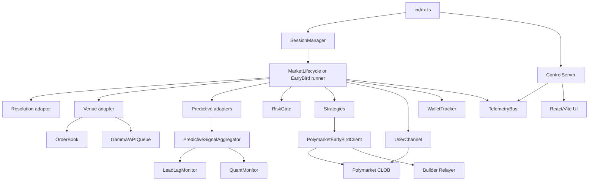
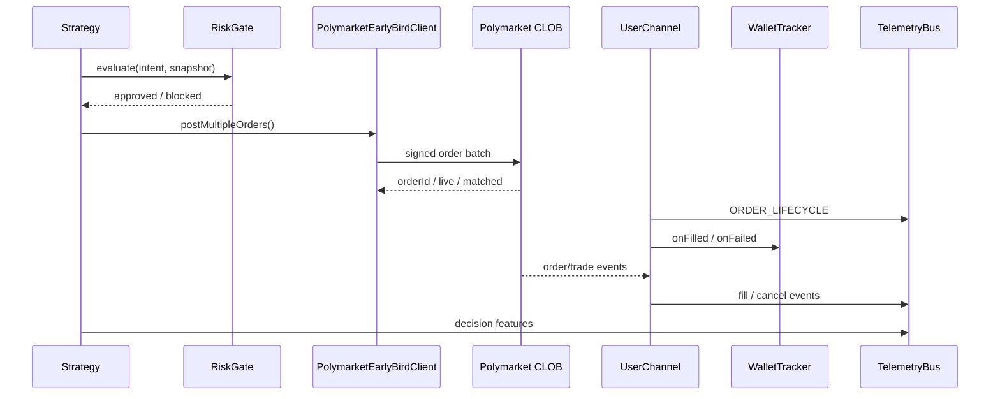

# Brogawd876 polymarket-trade-engine and prediction market trade engines

## Executive summary

The repository is not a full exchange or matching engine. It is a **trading bot and operator control plane built on top of Polymarket’s external CLOB, relayer, and settlement stack**. Locally, it implements market-data ingestion, strategy logic, risk gates, order tracking, replay/simulation, telemetry, and a small web control plane. It does **not** implement its own central limit order book matching, market creation, or proprietary oracle network. Those are delegated to Polymarket APIs, WebSockets, and Polygon contracts. fileciteturn60file0 fileciteturn67file0 fileciteturn68file0 citeturn12view0turn12view4turn14view0

That distinction matters for evaluation. As a **bot platform**, the repo has several strong traits: a reasonably clean adapter model for venue, predictive, and resolution feeds; replay and paper-trading tooling; a telemetry bus and operator API; a live-readiness/promotion workflow; and broad module-level test coverage with a simple GitHub Actions test job. fileciteturn39file0 fileciteturn44file0 fileciteturn46file0 fileciteturn59file0 fileciteturn60file0 fileciteturn63file0

The main weaknesses are in **correctness under real market microstructure, production hardening, and operational fail-safety**. The most important issues are: inference of trade direction from the public feed despite recent evidence that Polymarket public-feed trade direction is only modestly aligned with on-chain truth; permissive execution-quality defaults that are explicitly too loose for production unless overridden; simplistic simulation fills that can overstate replay quality; lack of explicit handling for official weekly Polymarket matching-engine restarts; and an unauthenticated local operator API that exposes configuration and log surfaces if the host is exposed. fileciteturn37file0 fileciteturn40file0 fileciteturn41file0 fileciteturn67file0 fileciteturn69file0 fileciteturn60file0 citeturn25view0turn13view6

The single most important architectural conclusion is this: **the repo should be treated as a strategy/execution framework, not as authoritative market infrastructure**. For that reason, the best upgrade path is not “build more exchange internals,” but rather “make external dependencies explicit, fail closed, improve market microstructure fidelity, and add production-grade observability and deployment controls.” fileciteturn68file0 fileciteturn59file0 citeturn11view0turn15view1turn20view1

## Repository anatomy and architecture

At the repository level, the codebase is a Bun/TypeScript project with a separate React/Vite UI under `ui/`. The root package defines trading, server, replay, and strategy-lab workflows, while the UI package defines its own build/lint/dev scripts. The repo also includes operator docs, migration notes, analysis scripts, and a large test tree covering engine, tracker, utils, and server modules. fileciteturn20file0 fileciteturn72file0 fileciteturn21file0 fileciteturn65file0 fileciteturn71file0 fileciteturn61file0

The reviewed branch exposes two layers of orchestration. The **control plane** starts a telemetry bus, a session manager, and a Bun-based REST/WebSocket operator server. The **execution plane** contains both legacy strategy runner logic (`engine/early-bird.ts`) and a newer modular stack under `engine/bot-core/*`, including feed adapters, aggregation, lead-lag tracking, quant monitoring, risk gates, replay infrastructure, and readiness promotion tooling. fileciteturn22file0 fileciteturn60file0 fileciteturn74file0 fileciteturn59file0

This architecture is consistent with the files reviewed: `index.ts`, `engine/server/index.ts`, `engine/session-manager.ts`, `engine/bot-core/index.ts`, the feed adapters, `tracker/orderbook.ts`, `engine/client.ts`, and `engine/user-channel.ts`. fileciteturn22file0 fileciteturn60file0 fileciteturn23file0 fileciteturn74file0 fileciteturn76file0 fileciteturn67file0 fileciteturn69file0

A concise inventory of the highest-value modules is below.

| Area | Main files | What it does |
|---|---|---|
| Bootstrap and control | `index.ts`, `engine/server/index.ts`, `engine/session-manager.ts` | Starts engine, operator API, telemetry, and session orchestration |
| Market data | `tracker/orderbook.ts`, `tracker/api-queue.ts`, `engine/bot-core/polymarket-venue-adapter.ts` | Maintains local book state, fetches market metadata, emits normalized venue events |
| Resolution feed | `engine/bot-core/polymarket-resolution-adapter.ts` | Reads Polymarket/Chainlink-style crypto price feed and open/close reference prices |
| Predictive feeds | `engine/bot-core/binance-predictive-adapter.ts`, `coinbase-predictive-adapter.ts`, `predictive-signal-aggregator.ts`, `lead-lag-monitor.ts` | External price discovery for signal generation and feed-health analysis |
| Quant and strategy | `engine/bot-core/quant-monitor.ts`, `engine/strategy/*`, `utils/math.ts` | Computes volatility/probabilities and turns them into order intents |
| Risk and wallet state | `engine/bot-core/risk-gate.ts`, `engine/wallet-tracker.ts` | Static limits, execution-quality gating, and local exposure accounting |
| Execution and settlement | `engine/client.ts`, `engine/user-channel.ts`, `engine/market-lifecycle.ts` | Posts orders, tracks fills, cancels, wraps/unwraps pUSD, redeems positions |
| Experimentation and release gating | `engine/strategy-lab.ts`, `engine/live-readiness.ts`, `engine/decision-features.ts` | Replay batches, paper evidence, strategy presets, promotion workflow |
| Tooling and docs | `README.md`, `docs/GUIDE.md`, `docs/MIGRATE_V2.md`, `.github/workflows/test.yml` | Setup, operator guidance, pUSD migration, CI test job |

The presence of `engine/client.ts` and `scripts/pusd.ts` shows that the repo interacts with Polygon contracts and the Polymarket relayer, but the reviewed tree does not expose in-repo Solidity contracts or contract deployment tooling. Instead, it hardcodes and uses external contract addresses and APIs. fileciteturn67file0 fileciteturn68file0 fileciteturn66file0 fileciteturn65file0

The smart-contract integration visible in the code is operational rather than protocol-authoring. The client uses `@polymarket/clob-client-v2`, `@polymarket/builder-relayer-client`, and `viem`; it hardcodes relayer/RPC endpoints and addresses for USDC.e, pUSD, onramp, offramp, and a redemption target, and encodes `wrap`, `unwrap`, and `redeemPositions` calls. Polymarket’s current contract documentation confirms the pUSD, onramp, and offramp addresses, and documents the CTF Exchange V2, Conditional Tokens, deposit wallet factory, and UMA resolution contracts. fileciteturn67file0 fileciteturn68file0 citeturn14view0turn13view7

That flow matches the code path in `risk-gate.ts`, `client.ts`, `user-channel.ts`, `wallet-tracker.ts`, and `decision-features.ts`, and it also matches Polymarket’s documented order lifecycle of `live`, `matched`, `delayed`, `unmatched`, then trade states such as `MATCHED`, `MINED`, and `CONFIRMED`. fileciteturn40file0 fileciteturn41file0 fileciteturn68file0 fileciteturn69file0 fileciteturn70file0 fileciteturn58file0 citeturn13view4

## Component mapping to core trade-engine functions

The easiest way to understand the repo is to map each standard trade-engine responsibility to either **local implementation**, **external delegation**, or **not implemented**.

| Trade-engine function | Repo status | Main components | Assessment |
|---|---|---|---|
| Order matching | Delegated externally | `engine/client.ts`, Polymarket CLOB | No local matcher. The repo signs and posts orders to Polymarket’s CLOB and tracks returned statuses. This is correct for a bot, but it means matching semantics, queue priority, and partial-fill behavior are not under repo control. fileciteturn68file0 citeturn12view0turn13view4 |
| Order book maintenance | Local read-only cache | `tracker/orderbook.ts`, `engine/bot-core/polymarket-venue-adapter.ts` | The repo maintains local bid/ask state from Polymarket public market WebSocket messages and exposes best bid/ask, liquidity, tick size, and fee-rate hints. fileciteturn36file0 fileciteturn37file0 fileciteturn76file0 citeturn12view0 |
| Risk management | Local | `engine/bot-core/risk-gate.ts`, `engine/wallet-tracker.ts` | Implements static limits, execution-quality checks, feed freshness checks, open exposure caps, session-loss caps, and local wallet reservations. This is useful, but still fairly shallow relative to institutional pre-trade risk. fileciteturn40file0 fileciteturn41file0 fileciteturn70file0 |
| Settlement and post-trade handling | Mixed | `engine/user-channel.ts`, `engine/client.ts`, `engine/market-lifecycle.ts` | Fill tracking is local; final settlement is external. The repo can cancel orders, observe fills, update balances, and call `redeemPositions`, but it does not own settlement finality. fileciteturn68file0 fileciteturn69file0 citeturn13view4turn14view0 |
| Fee model | Mixed | `tracker/orderbook.ts`, `engine/bot-core/risk-gate.ts`, `engine/strategy/fair-value-maker.ts` | The repo reads fee-rate information from feed metadata and uses fee-aware gating, but it does not fully model maker rebates or liquidity-reward economics in execution logic. Polymarket’s fee and rebate formulas are external and more nuanced than the local use of `feeRateBps`. fileciteturn37file0 fileciteturn41file0 fileciteturn54file0 citeturn13view0turn16view0turn16view2 |
| Market creation | Not implemented | `tracker/api-queue.ts`, `polymarket-venue-adapter.ts` | The repo fetches existing market/event metadata by slug from Gamma and uses known token IDs/condition IDs. It does not create new markets. fileciteturn77file0 fileciteturn76file0 |
| Oracle integration | Partial, externalized | `polymarket-resolution-adapter.ts`, `APIQueue`, `client.ts` | The repo consumes Polymarket live crypto-price and crypto-price API endpoints and later redeems positions via contracts. It does not implement dispute logic, oracle voting, or generalized resolution infrastructure. fileciteturn48file0 fileciteturn77file0 fileciteturn68file0 citeturn12view4turn14view0 |
| Signal aggregation | Local | `predictive-signal-aggregator.ts`, `lead-lag-monitor.ts`, `quant-monitor.ts`, `trade-tape.ts` | This is a notable repo strength. The code combines venue state, external price feeds, order flow, latency leadership, and a digital-option fair-value model into strategy inputs. fileciteturn44file0 fileciteturn46file0 fileciteturn42file0 fileciteturn38file0 fileciteturn78file0 |
| Replay, paper, and promotion | Local | `strategy-lab.ts`, `live-readiness.ts`, `decision-features.ts` | Another strength. The repo includes replay batches, scoring, paper evidence capture, preset promotion, and tiny-live unlock logic. fileciteturn71file0 fileciteturn59file0 fileciteturn58file0 |
| Operator API and observability | Local | `engine/server/index.ts`, telemetry modules | Operator endpoints, telemetry stream, logs access, replay fixture validation, experiment orchestration, and readiness APIs are built in. fileciteturn60file0 |

Two strategies stand out. The **late-entry** family is a directional strategy using time-to-close, certainty thresholds, gap/volatility filters, liquidity checks, and optional order-flow filters. The **fair-value-maker** strategy uses a digital-call probability estimate, inventory skew, volatility buffer, and optional flow filters to place resting GTC buy quotes on both sides. Both are valid approaches for prediction-market microstructure, but only the latter resembles a true market-making engine. fileciteturn53file0 fileciteturn54file0 fileciteturn55file0 fileciteturn56file0 fileciteturn57file0

From a “prediction market engine” perspective, the repo therefore covers **execution, signal generation, and operator controls** far more than **venue mechanics**. That is the right split for a Polymarket strategy framework, but it also means several trade-engine best practices must be implemented as **guards around external dependencies**, not as internal market-core code. fileciteturn68file0 fileciteturn59file0 citeturn15view0turn15view1

## Risks, correctness concerns, and code-linked findings

The table below focuses on the most concrete risks with direct code locations.

| Priority | Risk | Code location | Why it matters |
|---|---|---|---|
| High | Public-feed trade direction is inferred heuristically, and size is missing for some events | `tracker/orderbook.ts::_recordTapeTrade`; `tracker/trade-tape.ts::_calculateCVD`, `_deriveSentiment` | `_recordTapeTrade` guesses side from `last_trade_price` and records `size: 0` for that path. Recent Polymarket microstructure evidence finds public-feed trade direction agrees with on-chain truth only about 59% of the time, which makes CVD/sentiment-derived strategy gates materially noisy. fileciteturn37file0 fileciteturn38file0 citeturn25view0 |
| High | Execution-quality defaults are intentionally too permissive for production | `engine/bot-core/risk-gate.ts::DEFAULT_EXECUTION_QUALITY_LIMITS`; `ExecutionQualityGate.evaluate` | Defaults allow 1.0 USD spread, 60-second venue age, zero required liquidity, 100% slippage, and no profitability requirement. The code comment itself says production configs must override these values. That is fragile and should fail closed in prod. fileciteturn40file0 fileciteturn41file0 |
| High | Simulator realism is weak relative to real exchange behavior | `engine/client.ts::isSimFilled`, `EarlyBirdSimClient`, `engine/user-channel.ts::SimUserChannel` | The sim fill model mostly checks best bid/ask crossing plus a simple liquidity threshold and does not model queue position, matching delay, market pauses, or authentic settlement latency. Replay/paper promotion may therefore overstate expected live quality. fileciteturn67file0 fileciteturn69file0 citeturn13view4 |
| High | Operator API has no authentication layer | `engine/server/index.ts` fetch handlers, especially `/api/operator/config`, `/api/operator/logs`, session-control endpoints | The server binds to localhost and checks allowed origins, which helps, but there is no operator auth token, mTLS, or signed session model. If the host is tunneled, proxied, or otherwise exposed, config and logs become sensitive. fileciteturn60file0 |
| High | Potential contract-address drift in redemption path | `engine/client.ts::CTF_ADDRESS`, `redeemPositions` | The repo hardcodes a `CTF_ADDRESS` for `redeemPositions` that does not visibly match the current official Conditional Tokens address on Polymarket’s contract page. pUSD, onramp, and offramp align, but the redemption target deserves immediate verification before production. fileciteturn67file0 fileciteturn68file0 citeturn14view0 |
| Medium | No explicit maintenance-window handling for documented weekly matching-engine restarts | `tracker/orderbook.ts::subscribe`, `engine/user-channel.ts::_connect`, `engine/client.ts::postMultipleOrders` | Polymarket documents weekly Tuesday 7:00 AM ET matching-engine restarts with temporary unavailability and API `425` responses. The repo has reconnect logic but no explicit exchange-status gate, blackout schedule, or backoff policy keyed to this maintenance window. fileciteturn36file0 fileciteturn69file0 fileciteturn68file0 citeturn13view6 |
| Medium | Side detection fallback is brittle | `engine/bot-core/risk-gate.ts::ExecutionQualityGate.evaluate` | If `snapshot.clobTokenIds` is missing, the code falls back to `intent.tokenId.toLowerCase().includes("up")`. Token IDs are not semantically guaranteed to encode side, so this fallback can silently misclassify order side. fileciteturn40file0 |
| Medium | Event loop churn and quote churn risk in late-entry strategy | `engine/strategy/late-entry.ts::lateEntry` | The strategy uses `setInterval(..., 0)`, effectively a busy poll. That can increase CPU load, telemetry noise, and race/churn risk under multiple sessions or on modest hardware. fileciteturn56file0 fileciteturn57file0 |
| Medium | Hard-fail process exits in data pipeline | `tracker/api-queue.ts::queueMarketPrice`; `engine/strategy/late-entry.ts::lateEntry` | `queueMarketPrice` can `process.exit(1)` on `ECONNRESET`, and the late-entry strategy exits the process if `PROD` is set. Library-level or strategy-level logic should not kill the whole operator process. fileciteturn77file0 fileciteturn56file0 |
| Medium | Wallet mode and signature-path assumptions lag current platform guidance | `engine/client.ts` constructor/init | The code supports multiple signature types and funder modes, but official docs now recommend deposit wallets for new API users and a `signature_type = 3` flow with explicit balance-sync behavior. The repo should reduce ambiguous wallet-mode configuration and enforce the modern path by default. fileciteturn68file0 citeturn11view0turn13view8turn15view1 |
| Medium | Fee/rebate economics are only partially modeled | `engine/strategy/fair-value-maker.ts::quoteEv`; `risk-gate.ts` fee-aware gating | Official Polymarket fees are nonlinear in price and only takers pay them; maker rebates and liquidity rewards are separate daily economics. The repo’s maker strategy mostly computes quote edge from probability minus price and an optional rebate estimate, which is directionally reasonable but incomplete. fileciteturn54file0 fileciteturn41file0 citeturn13view0turn16view0turn16view2 |

A few strengths deserve explicit mention because they reduce other categories of risk. The adapter interfaces are clean; the repo distinguishes resolution, venue, and predictive feeds; replay tooling exists; and the live-readiness manager provides a much better promotion path than “flip prod on and hope.” Those are meaningful positives. fileciteturn39file0 fileciteturn44file0 fileciteturn46file0 fileciteturn71file0 fileciteturn59file0

The most serious correctness risk is still the order-flow layer. The repo’s flow-aware logic is architecturally attractive, but public-feed directional inference on Polymarket is now empirically weak enough that it should not be treated as a trusted signal without cross-checking against user fills or on-chain `OrderFilled` events. fileciteturn37file0 fileciteturn38file0 citeturn25view0

## Improvements, migration path, and testing recommendations

The improvement program should be staged by impact and effort, not by code ownership.

| Impact | Effort | Recommendation | Why |
|---|---|---|---|
| Very high | Medium | Replace public-feed trade-direction inference with authoritative user fills and, where possible, on-chain `OrderFilled` joins | This directly improves CVD, whale detection, and any strategy or risk gate using flow. fileciteturn37file0 fileciteturn38file0 citeturn25view0turn25view1 |
| Very high | Low | Fail closed in production unless strict execution-quality and static risk limits are explicitly set | This removes the dangerous dependency on permissive defaults. fileciteturn40file0 fileciteturn41file0 |
| Very high | Medium | Add operator authentication and optional read-only mode for the control server | Localhost binding is not enough for a trading operator surface. fileciteturn60file0 |
| High | Medium | Add exchange-maintenance awareness and pause logic keyed to official restart windows and API failures | Weekly restart handling should be deterministic, not accidental. citeturn13view6turn20view1 |
| High | Medium | Verify and centralize all contract addresses against official docs at startup | This is especially important for redemption and any relayer batch execution. fileciteturn68file0 citeturn14view0 |
| High | High | Upgrade the simulator to include queue position, matching delay, partial fills, stale-book scenarios, and pause windows | Replay and paper promotion are only as good as sim realism. fileciteturn67file0 fileciteturn69file0 |
| High | Medium | Refactor strategy timers to event-driven or coarse scheduled loops | `setInterval(0)` is an anti-pattern here. fileciteturn56file0 |
| Medium | Medium | Persist a normalized event store for metadata, fills, oracle/resolution events, and decision features | This matches emerging best practice for reproducible prediction-market analysis and validation. fileciteturn58file0 citeturn25view1 |
| Medium | Low | Strongly type wallet mode and default new deployments to deposit wallets with `signature_type = 3` | This aligns with current platform guidance. fileciteturn68file0 citeturn13view8turn15view1 |
| Medium | Low | Model maker rebate and liquidity-reward economics explicitly in the maker strategy | The current fair-value-maker is directionally sensible but incomplete on venue economics. fileciteturn54file0 citeturn16view0turn16view2 |

A migration/deployment checklist follows.

- **Pin the release target**: deploy from a tagged commit, not an ad hoc branch head. Record the git commit in telemetry and release artefacts. fileciteturn58file0
- **Prefer deposit wallets for new deployments**: use the documented deposit-wallet flow, `signature_type = 3`, fund with pUSD, make approvals from the wallet, and run balance/allowance sync before trading. citeturn11view0turn13view8turn15view1
- **Verify contract addresses at startup**: compare configured/hardcoded addresses against the official Polymarket contracts page and fail boot on mismatches, especially for redemption targets. fileciteturn68file0 citeturn14view0
- **Run pUSD migration steps explicitly**: if starting from USDC.e, use the wrap flow or equivalent wallet UI flow before the engine attempts live orders. fileciteturn65file0 fileciteturn66file0 citeturn13view7
- **Harden production risk**: require explicit non-default values for spread, max venue age, min liquidity, max slippage, profitability check, max exposure, and max session loss. fileciteturn40file0 fileciteturn41file0
- **Prove the strategy on replay and holdout first**: only promote via replay batch, paper evidence, and tiny-live unlock phases. The repo already has the scaffolding for this; use it consistently. fileciteturn71file0 fileciteturn59file0
- **Gate around official restart windows**: pause or drain exposure ahead of the weekly Tuesday 7:00 AM ET matching-engine maintenance window unless there is a documented reason not to. citeturn13view6
- **Lock down the operator surface**: add a local auth token, disable config/log endpoints in shared environments, and expose a read-only status mode separately. fileciteturn60file0
- **Add health probes**: CLOB REST, market WS, user WS, relayer, Polygon RPC, Gamma API, and resolution API. Refuse trading if any required dependency is degraded. fileciteturn48file0 fileciteturn76file0 fileciteturn77file0 fileciteturn68file0
- **Promote observability from logs to SLOs**: latency, freshness, stale-feed counts, order-reject rates, cancel/replace churn, quote age, fill slippage, and end-to-end decision-to-fill latency should all be first-class metrics. fileciteturn58file0 fileciteturn60file0

The current CI is very small. It checks out the repo, installs Bun, and runs `bun test` on pushes and PRs targeting `master`. That is useful, but incomplete for a repo with a UI package, operator server, market-data adapters, and production wallet logic. fileciteturn63file0

A stronger CI/CD and testing matrix should look like this.

| Area | Recommended checks |
|---|---|
| Core CI | `bun test`, `bun x tsc --noEmit`, root script smoke tests, UI `npm` or `bun` build, ESLint, lockfile consistency |
| Security CI | secret scanning, dependency audit, Semgrep/CodeQL, forbidden-endpoint tests for operator API |
| Runtime matrix | Bun stable and pinned production version; Ubuntu at minimum, plus one macOS runner for portability if needed |
| Market matrix | 5m and 15m windows; BTC, ETH, and at least one smaller-activity asset |
| Wallet matrix | EOA, legacy proxy/safe if still supported, and deposit-wallet `signature_type = 3` |
| Failure matrix | stale predictive feed, missing resolution feed, 403/geoblock, relayer failure, Polygon RPC timeout, matching-engine restart, tick-size change, order reject, partial fill, late cancel |
| Strategy matrix | simulation, late-entry variants, fair-value-maker, strategy-lab batches, paper promotion, tiny-live unlock prechecks |
| Replay realism | queue-position scenarios, low-liquidity books, adverse selection, repeated cancel/replace churn, true pause windows, restart recovery |
| CD gates | protected branch, required CI checks, signed artifacts, immutable build metadata, staged promotion from replay → paper → tiny-live |

The broad test inventory in the repo suggests the author already values verification. The gap is less about “absence of tests” and more about “absence of production-grade deployment and environment matrices.” fileciteturn61file6 fileciteturn61file7 fileciteturn61file9 fileciteturn61file12 fileciteturn61file15 fileciteturn61file17 fileciteturn61file20 fileciteturn61file34 fileciteturn61file35 fileciteturn61file41 fileciteturn63file0

## Best-practice comparison and reference designs

The repo’s design is closest to an **execution-side market-making/research stack**. It is not a bounded-loss AMM, not a generalized conditional-token protocol, and not a regulated exchange core. The most useful comparison set is therefore: Polymarket’s official CLOB/MM model, Kalshi’s exchange API model, Gnosis Conditional Tokens for settlement primitives, inventory-aware market-making literature, and bounded-loss AMM literature. citeturn12view0turn15view0turn19view0turn23view0turn27academia1turn26academia3

| Reference | What it represents | Strength relative to this repo | Gap relative to this repo |
|---|---|---|---|
| **Polymarket official CLOB + market-maker docs** citeturn11view0turn12view0turn13view4turn15view0turn15view1turn16view0turn14view0 | The actual venue and wallet model this repo trades on | Authoritative semantics for orders, fees, rebates, contracts, deposit wallets, and restarts | Does not provide repo-specific strategy, replay, or operator-control logic |
| **Kalshi official API docs** citeturn19view0turn20view0turn20view1 | A contrasting production prediction-market exchange API | Explicit exchange-status endpoint, authenticated WebSocket design, more exchange-native API surface | Different regulatory and architectural environment; not decentralized/on-chain settlement |
| **Gnosis Conditional Tokens docs** citeturn23view0 | The generalized conditional-token settlement primitive heavily relevant to prediction markets | Strong abstraction for conditions, positions, splits, merges, and redemption | Not an order-book execution framework; more protocol primitive than trading engine |
| **Guéant / Avellaneda-Stoikov style market making** citeturn27academia1turn27academia0 | Inventory-aware quoting and reservation-price theory for limit order books | Validates the repo’s inventory skew and spread-buffer direction in `fair-value-maker` | Repo implementation is much simpler and lacks proper arrival modeling, queue-position modeling, and formal calibration |
| **Utility / LMSR bounded-loss market maker literature** citeturn26academia3 | AMM-style prediction-market mechanism with bounded-loss guarantees | Useful contrast: bounded-loss AMMs guarantee liquidity and loss bounds in ways a CLOB bot does not | Repo is not an AMM and gives up bounded-loss guarantees for CLOB-style execution and richer microstructure |

Two additional sources sharpen the comparison. First, the 2026 full-lifecycle Polymarket dataset paper argues that robust prediction-market analysis needs unified metadata, fill-level trading records, and oracle-resolution events in one synchronized data model. The repo has pieces of that idea in `decision-features.ts`, `strategy-lab.ts`, and `live-readiness.ts`, but it does not yet look like a durable relational event warehouse. Second, the 2026 Polymarket microstructure paper shows that public-feed trade direction is not reliable enough for serious microstructure inference on its own, which directly undermines the repo’s current flow heuristics. fileciteturn58file0 fileciteturn71file0 fileciteturn59file0 citeturn25view1turn25view0

Against common best practice, the repo scores well on **modularity, replayability, staged promotion, and control-plane visibility**. It scores only moderately on **production risk discipline**, and weakly on **microstructure-faithful simulation, exchange-status awareness, and robust external-dependency handling**. That is a good foundation for a serious bot framework, but not yet the standard of a fully hardened live-trading platform. fileciteturn39file0 fileciteturn59file0 fileciteturn71file0 fileciteturn60file0 citeturn20view1turn25view0

## Open questions and limitations

This report is based on repository inspection through the GitHub connector and official/public documentation, not on executing the bot live against Polymarket. Because of that, I can assess architecture and code-path risk with high confidence, but not live fill rates, real-world latency, or whether some hardcoded addresses reflect a still-valid undocumented migration path. The most important unresolved item is the redemption target address in `engine/client.ts`; that should be verified against current Polymarket contract documentation before any production use. fileciteturn68file0 citeturn14view0

A final limitation is that the repo includes both legacy runner code and newer modular bot-core code. The control-plane and adapter abstractions are clear enough to evaluate, but some exact runtime selection paths depend on session-manager wiring and operator usage patterns rather than a single canonical code path. That does not change the main conclusion: the repository is a capable **Polymarket strategy/execution framework**, but it should be hardened around **microstructure correctness, fail-closed production defaults, operator auth, exchange-status handling, and address/config validation** before it is treated as a dependable live-trading system. fileciteturn23file0 fileciteturn24file0 fileciteturn59file0