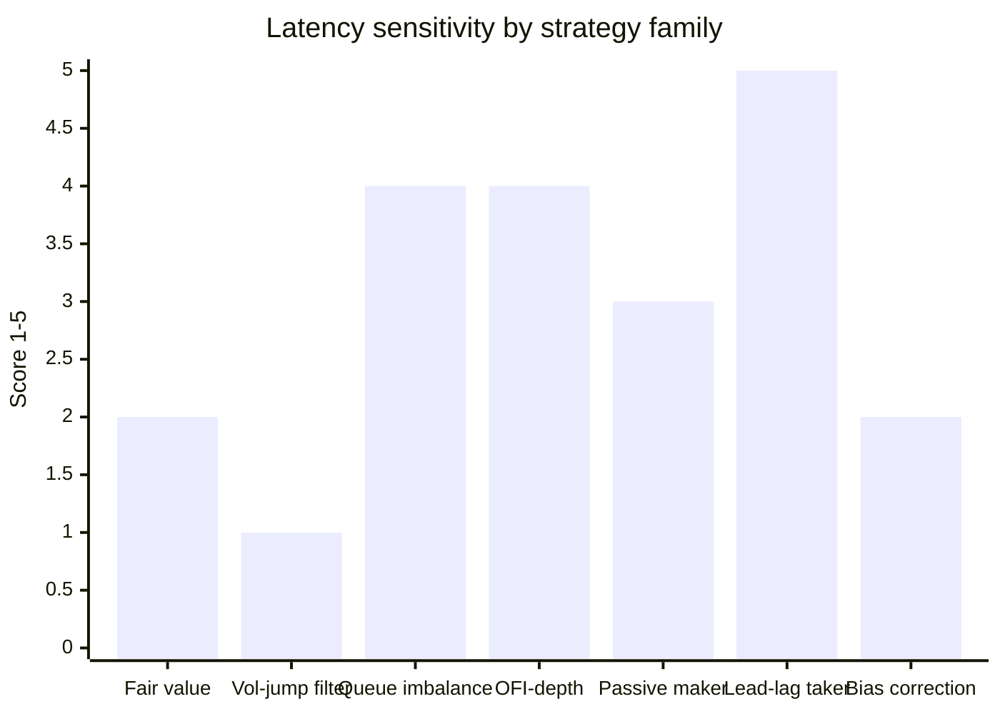
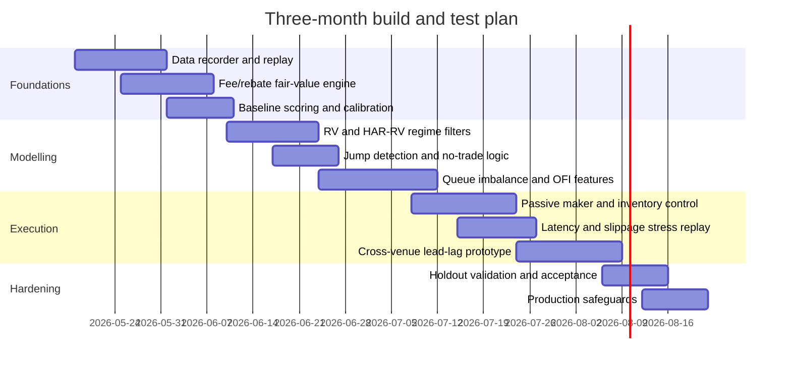

# Established Quantitative Techniques for Polymarket BTC Five-Minute Trading

## Executive summary

The best first implementation for a Polymarket BTC five-minute bot is not a pure speed race. The strongest initial stack is a **fee-aware fair-value engine for a short-dated digital contract**, fed by **external BTC spot data**, **realized-volatility and jump regime filters**, **probability calibration**, and **maker-first execution with inventory control**. The reason is structural: Polymarket’s crypto markets use a CLOB with live L2 market data, marketable orders are just FOK/FAK limit orders, makers pay no fees and receive maker rebates, while takers pay fees that are largest around 50/50 prices, exactly where many short-expiry contracts spend most of their life. That makes mispriced passive quoting and adverse-selection control much more attractive as a first edge than aggressive taker arbitrage. citeturn20search2turn20search1turn20search4turn13search0turn13search1turn20search12turn20search14

For this contract family, the market is economically a **binary or digital option on whether BTC closes above its opening reference price over the next five minutes**. The Polymarket market page states that these contracts resolve on whether the ending BTC price is greater than or equal to the starting price, and that the resolution source is the Chainlink BTC/USD stream. That means the core problem is estimating a calibrated physical probability of finishing above a threshold, then translating that probability into expected value after fees, rebates, spread, and fill risk. citeturn21search1turn21search7turn22view9

The priority order is therefore straightforward. Build first: data recorder and replay, fair-value model, volatility and jump regime filter, calibration and sizing, then passive execution and adverse-selection controls. Build later: cross-venue lead-lag taker logic and ultra-short-horizon microstructure scalping. The literature supports this ordering because realized-volatility models, jump-robust estimators, and calibration methods are comparatively robust to moderate latency, while lead-lag and OFI-based taker strategies are much more fragile to timestamp error, queue position, and connection latency. citeturn22view1turn26view1turn32view0turn31view0turn29view0turn37view1turn37view4

There is no defensible way to know in advance that one strategy is “the best.” The literature points instead to a model-selection regime: compare candidates out of sample using **net PnL after fees and slippage**, **Brier score**, **log loss**, **calibration curves**, **fill rate**, and **post-fill markouts** under realistic latency replay. Proper scoring-rule theory matters here because a binary trader with uncalibrated probabilities will oversize and overtrade even if the signal is directionally useful. citeturn33view2turn33view3turn33view0turn33view1turn17search7turn22view7turn7search1

## Market framing for Polymarket BTC five-minute contracts

Polymarket’s trading stack is a hybrid CLOB: orders are created off-chain, matched by the operator, and settled on Polygon. Public market-data endpoints provide prices, spreads, order books, and historical price data; private trading endpoints require authenticated CLOB access. Polymarket’s official documentation now points builders to the **v2** clients in TypeScript, Python, and Rust, while the older TypeScript and Python CLOB clients are explicitly marked archived and not functional for new integrations. citeturn20search2turn20search11turn13search6turn13search2turn20search13turn8search18turn8search14turn8search21turn8search2turn8search3

For execution, all Polymarket orders are limit orders underneath; “market orders” are implemented by posting marketable limit orders, with GTC/GTD for resting quotes and FOK/FAK for immediate execution. That matters for simulation and real trading, because your realised edge depends on whether you rest and get hit, cross the spread and pay taker fees, or partially fill and cancel. citeturn20search4turn20search1

The fee model is unusually important. For Polymarket’s crypto category, the fee is  
`fee = C × feeRate × p × (1 - p)`,  
with makers not charged fees and eligible for a maker rebate, while takers pay the fee. Because \(p(1-p)\) peaks near \(p=0.5\), effective taker cost is highest around fair-coin contracts, exactly where five-minute BTC markets often sit. That is a mechanical reason to prefer maker-first logic unless you have a very strong and very fast taker signal. citeturn13search0turn13search1

Displayed website prices also need care. Polymarket states that the displayed price is the midpoint of the bid-ask spread, but if the spread is wider than $0.10, the last traded price is shown instead. For modelling and backtests you therefore want true bid/ask state from the book, not the website display field. citeturn13search10

The specific BTC five-minute market page states that the contract resolves on whether the ending BTC price is greater than or equal to the starting price, and that the resolution source is the Chainlink BTC/USD data stream. This creates **reference-source basis risk**: your forecasting inputs will likely come from spot exchanges such as Binance and Coinbase, whose public WebSocket feeds provide real-time trade and L2 data, but the contract settles against Chainlink’s reference process, not any one exchange tape. That is a direct reason to use multi-venue spot inputs and to treat cross-venue timing differences as a first-class risk. citeturn21search1turn8search0turn8search1turn8search12

A practical limitation follows from the documentation. Polymarket documents historical **price** history and current **book** endpoints, and documents the live market WebSocket, but it does not document a historical depth-replay endpoint for full L2 order-book history. The natural inference is that if you want robust microstructure backtests, you need to **self-record** Polymarket WebSocket book events and trades from day one. citeturn13search2turn13search6turn13search7turn20search12turn20search14

## Research survey of established methods

### Binary pricing and calibrated fair value

The right conceptual starting point is digital-option pricing. In Black-Scholes form, a cash-or-nothing call with fixed payout \(A\) is the discounted risk-neutral probability of finishing in the money; Higham’s notes on cash-or-nothing options and QuantLib’s digital-option support make this explicit at the implementation level. For a unit payoff and a five-minute threshold contract, the trading problem collapses to estimating \(P(S_T \ge K)\), where \(K\) is the window’s starting reference price. On Polymarket, an unhedged YES share bought at price \(\pi\) has expected gross payoff \(p - \pi\), so the usable edge is simply **estimated probability minus market price minus execution cost**. citeturn26view0turn39view0turn39view4turn10search2turn10search4turn10search5

The limitation is equally important. Prediction-market prices are not guaranteed to equal objective probabilities. Wolfers and Zitzewitz show that prediction-market prices are often useful probability estimates, but can be biased by risk aversion and heterogeneous beliefs. So digital pricing gives the correct contract geometry, but not the final tradable probability. You still need empirical calibration. citeturn22view9

Calibration is well-established. Niculescu-Mizil and Caruana show that different classifiers produce systematically distorted probabilities, and that **Platt scaling** and **isotonic regression** can correct them, with Platt typically safer on small calibration sets and isotonic catching up or outperforming when calibration data are large. Scikit-learn’s calibration guide formalises the operational side: a well-calibrated binary classifier should make 0.8 predictions that come true about 80% of the time, and calibration curves or reliability diagrams are the correct tool to test this. citeturn32view3turn33view5turn33view6turn36view0turn36view1turn36view2

For Polymarket BTC five-minute trading this method family is **high priority, low-to-medium latency dependence, low compute cost, and robust to moderate data gaps**. It is not a strategy by itself; it is the pricing layer every strategy should use. Its main pitfalls are misalignment between exchange spot and settlement source, naive use of website display prices, and confusing risk-neutral option math with physical win probabilities. citeturn21search1turn13search10turn22view9

### Short-horizon volatility forecasting and jump models

The volatility literature is directly applicable because the contract is a near-expiry threshold problem. Andersen, Bollerslev, Diebold, and Labys show that realized volatility formed from high-frequency returns is an efficient measure of actual return variability. Corsi’s HAR-RV model then forecasts future realized volatility with a simple linear structure across daily, weekly, and monthly realized-volatility components, which is attractive because it is parsimonious and empirically effective. citeturn22view1turn26view1turn27view1

For very short horizons, jumps matter. Barndorff-Nielsen and Shephard show that realized bipower variation is robust to rare jumps and that the difference between realized variance and realized bipower variation estimates the quadratic variation of the jump component. In practice that gives a clean regime flag: if jumps are present, a diffusion-style short-horizon pricing model should widen uncertainty bands or reduce size. citeturn32view0

There is also a practical evaluation result. Patton’s volatility-forecast comparison work shows that some loss functions are more robust than others when real volatility is latent and only imperfect proxies are observed; QLIKE and MSE are the standard robust choices in that literature. That matters if you compare vol modules using realised measures from noisy exchange data. citeturn38search5turn38search15

For a BTC five-minute Polymarket bot, short-horizon volatility models are useful mostly as **uncertainty estimators and regime filters**, not as stand-alone directional models. They help answer when the market should be near 50/50, when a quoted edge is too small to survive fees, and when to widen or pull passive quotes. They are **low latency dependence, low-to-medium compute, and relatively robust to noisy data** if built on self-recorded or exchange-native high-frequency inputs. The main pitfall is overfitting directional drift on a horizon where volatility dominates mean. citeturn22view1turn26view1turn32view0turn38search16

### Order-book and microstructure signals

This is where a lot of real edge usually lives, but it is more fragile. Cont, Kukanov, and Stoikov show that short-interval price changes are driven mainly by **order-flow imbalance**, defined as net supply-demand pressure at the best bid and ask, and that the relation is approximately linear with slope inversely related to market depth. Their key practical point is that a trade-only view misses the quote-side information that actually forms prices. citeturn29view0

Gould and Bonart study **queue imbalance** and define it as the normalised difference between best-bid and best-ask queue sizes,  
\[
I(t)=\frac{n^b(b_t,t)-n^a(a_t,t)}{n^b(b_t,t)+n^a(a_t,t)}.
\]
They show predictive power for the direction of the next mid-price movement, especially for large-tick names, and model it naturally with logistic regression. That is a pragmatic template for Polymarket: convert book-state features into a probability of near-term repricing. citeturn37view1turn37view4

For Polymarket, the most defensible use of these signals is not “cross everything immediately,” but **quote skewing, entry timing, and adverse-selection avoidance**. If queue imbalance and OFI on Polymarket are telling you the book is about to move against your fair value, you should either pull your quote, widen your spread, or shift to the safer side. That exploits microstructure without requiring institutional-grade speed. This is **medium-to-high latency dependence**, because stale queue signals decay quickly, and it is **sensitive to data completeness**, because missing L2 updates ruin the state variables. citeturn29view0turn37view1turn37view4

A useful implication from the literature is that queue-based models can be used two ways. One is direct prediction of the next book move. The other, often better for prediction markets, is conditional execution: only place or leave quotes when book-state variables imply low adverse selection. That second use is more realistic if you are not colocated and may trade through a VPN. citeturn37view4turn27view3

### Cross-venue price discovery and lead-lag

Hasbrouck’s information-share framework treats multiple venues as noisy views of one latent efficient price and measures each venue’s contribution to price discovery. Gonzalo and Granger’s permanent-transitory decomposition provides the related permanent-component view in cointegrated systems. These are still the workhorse econometric methods for deciding which venue leads another on average. citeturn27view5turn26view7turn11search7

At higher frequency, asynchronous sampling matters. Hayashi and Yoshida’s estimator handles non-synchronous observations by summing products of overlapping increments rather than forcing artificial synchronisation. Huth and Abergel show how the Hayashi-Yoshida cross-correlation function can be used to study lead-lag structure without being fooled by pure liquidity effects; Aït-Sahalia, Fan, and Xiu extend the covariance estimation problem to noisy and asynchronous data with a QMLE-based estimator that explicitly avoids Epps-effect distortions. citeturn31view0turn30view0turn30view1turn26view8turn30view3turn30view4

The crypto literature says this is worth doing. Studies of Bitcoin price discovery find that more liquid venues tend to dominate price discovery, and that spot or highly liquid centralised venues usually lead less liquid representations of BTC. That is exactly the structural relation a Polymarket trader cares about: identify whether Binance/Coinbase moves tend to show up on Polymarket with a usable lag, and whether that lag survives your real network latency and crossing costs. citeturn14search3turn14search18turn14search21turn14search19

This family is **high expected edge if the lag is real, but very high latency sensitivity** when used as an aggressive taker strategy. It becomes less latency-sensitive if used as a **fair-value input for maker quotes** instead of a trigger to cross the spread. Its data requirements are the heaviest in the report: nanosecond precision is not necessary, but exchange-native timestamps, consistent clock sync, and self-recorded Polymarket book data are essential. The biggest pitfalls are timestamp alignment, settlement-source basis risk, and the fact that VPN latency can erase the edge of a taker implementation. citeturn21search1turn8search0turn8search1turn31view0turn29view0

### Prediction-market and betting-market behavioural effects

Prediction markets are useful because their prices often aggregate dispersed information, but the behavioural literature shows they are not perfectly calibrated in all contexts. Wolfers and Zitzewitz conclude that market prices are generally informative probability estimates but may be biased; Snowberg and Wolfers show that favorite-longshot bias has strong support as a misperception problem rather than simple rational risk-love in the horse-racing data they study. citeturn22view9turn22view10turn27view7

There is also evidence that information quality changes near closing. Betting-market studies of “late money” find that heavy last-minute order flow tends to be more informed and improves efficiency, while in-play betting-exchange work shows that informational efficiency and behaviour vary materially across time and event state. In the Polymarket BTC five-minute setting, the direct analogue is that **the last part of the window is likely the hardest part to beat**, because both external information and internal betting order flow are freshest there. citeturn6search0turn6search4turn6search8

This family is **moderate priority**. It should not be your main alpha model, but it is useful as a correction layer. Possible uses are: shrink extreme model probabilities back toward the market when liquidity is thin; avoid fading consensus too near expiry; and explicitly test whether prices at the tails or near the final 30–60 seconds are systematically too high or too low. The main pitfall is transportability: sports and horse-race anomalies do not automatically survive in an objective, bot-heavy crypto threshold market. citeturn22view10turn6search0turn6search8

### Execution and adverse-selection control

Avellaneda and Stoikov provide the standard inventory-aware market-making framework. Their reservation-price adjustment
\[
r(s,q,t)=s-q\gamma\sigma^2(T-t)
\]
moves quotes away from the mid as inventory accumulates, and their optimal spread adds an adverse-selection/fill-intensity term. The model’s assumptions are stylised, but the logic remains highly useful: if your “fair” probability is \(s\), inventory \(q\) should push your practical bid and ask away from \(s\), especially when uncertainty \(\sigma\) is high. citeturn26view2turn26view3turn27view2turn27view3

This maps well to Polymarket maker quoting. YES and NO inventory are just opposite inventory states in a binary contract, and volatility of the fair probability plays the same role as volatility of the underlying price in the classic model. The reason it belongs early in the roadmap is not that it creates alpha, but that it makes the alpha you do have tradable by reducing the variance of fills and avoiding one-sided inventory traps. Hummingbot’s documentation is useful here as an open-source execution reference for both Avellaneda-style market making and cross-exchange market making architecture. citeturn15search3turn15search6turn15search2turn15search5

This family is **high priority, medium latency dependence, low compute cost, and moderate robustness**. Its biggest weakness on Polymarket is parameter instability: fill intensities are not guaranteed to behave like the exponential Poisson assumptions in the paper, especially in episodically thin prediction markets. Treat it as an execution overlay, not a proof of profitability. citeturn27view2turn27view3

### Bet sizing and forecast evaluation

Kelly’s criterion and Breiman’s work are still the cleanest mathematical starting point for repeated betting with edge: if you know the probability and the net odds, the optimal long-run growth strategy is to size by expected log growth. In fixed-odds notation that gives the classic \(f^*=(bp-(1-p))/b\), where \(b\) is net odds and \(p\) is estimated win probability. In prediction markets, the practical lesson is simpler than the algebra: **never size on raw probabilities; size only on calibrated probabilities, and use fractional Kelly because model error is real.** citeturn22view7turn7search1

For evaluation, Brier score and log loss are the correct workhorses. Scikit-learn’s definitions align with the classical proper-scoring-rule literature: Brier is mean squared probability error, and log loss is negative log likelihood. Gneiting and Raftery’s scoring-rule framework is the right theoretical justification for using them in model selection. citeturn33view2turn33view3turn33view0turn33view1turn17search7

For a trading bot, the clean division is this. Use **Brier score, log loss, and reliability diagrams** to evaluate the probability model. Use **PnL, Sharpe, turnover, fill rate, slippage, and post-fill markouts** to evaluate the execution layer. If the probability model improves Brier but worsens markouts, you have a signal problem only in the execution context. If PnL improves but calibration worsens badly, you are probably overfitting a transient microstructure quirk. citeturn36view0turn36view2turn33view2turn33view0

## Applicability to Polymarket BTC five-minute and comparison table

The table below compares the main strategy families as they apply to this exact use case.

| Candidate | Core math / intuition | Latency dependence | Data needed | Complexity | Robustness | Expected edge type | Priority | Key sources |
|---|---|---:|---|---|---|---|---|---|
| Fee-aware digital fair value | Estimate \(P(\text{BTC close} \ge K)\); trade only when \(p-\pi\) exceeds cost | 2/5 | External BTC spot, contract threshold, Polymarket bid/ask, fees | Medium | High | Repricing / misvaluation | **Very high** | citeturn21search1turn26view0turn13search0turn13search10turn22view9 |
| HAR-RV + jump regime filter | Use realised vol and jump flags to set uncertainty, no-trade zones, width | 1/5 | Tick-level external BTC history | Medium | High | Better filtering, safer sizing | **Very high** | citeturn22view1turn26view1turn32view0turn38search16 |
| Queue imbalance model | Logistic \(P(\Delta m>0 \mid I)\) from best-queue imbalance | 4/5 | Polymarket L2 book, self-recorded history | Medium | Medium | Entry timing / quote skew | **High** | citeturn37view1turn37view4 |
| OFI + depth impact model | \(\Delta P \propto \text{OFI}/\text{depth}\) over short intervals | 4/5 | Polymarket L2 events, depth histories | Medium-High | Medium | Microstructure repricing | **High** | citeturn29view0 |
| Inventory-aware passive maker | Reservation price and spread depend on inventory and uncertainty | 3/5 | Fair value, book state, fills, inventory | Medium | Medium-High | Spread capture, lower adverse selection | **High** | citeturn27view2turn27view3turn15search3 |
| Cross-venue lead-lag taker | Use external venues as leaders; act on Polymarket lag | 5/5 | Binance/Coinbase trades/L2, Polymarket L2, synced clocks | High | Low-Medium | Fast information transfer | **Medium later** | citeturn31view0turn14search3turn14search21turn8search0turn8search1 |
| Behavioural / expiry correction | Test for favorite-longshot or late-window overreaction | 2/5 | Historical closes, odds path, time-to-expiry buckets | Low-Medium | Medium-Low | Bias correction | **Medium** | citeturn22view9turn22view10turn6search0turn6search8 |

The important conclusion is that the first four rows are complementary, not competing. A practical bot should use **fair value** to decide what the contract should be worth, **volatility and jumps** to decide when that estimate is trustworthy, **queue/OFI state** to decide how to trade it, and **inventory-aware execution** to decide how much risk to warehouse. The only row that truly requires an arms-race setup is the aggressive cross-venue taker strategy. citeturn21search1turn13search0turn29view0turn37view1turn27view3

A direct implication for a privacy-conscious setup is clear. If you must trade through a VPN, the **least damaged** strategy families are fair-value modelling, volatility filters, calibration, and maker-first inventory-aware execution. The most damaged is fast cross-venue taker arbitrage. That is not a guess; it follows directly from the dependence of lead-lag and queue-based taker logic on timestamp fidelity and queue position. citeturn31view0turn29view0turn37view1turn27view3

## Implementation roadmap and validation program

The roadmap below is intentionally ordered to minimise dependence on ultra-low-latency infrastructure. It assumes that you start by self-recording all live data needed for replay, because documented historical depth replay is not exposed by Polymarket. citeturn13search2turn13search6turn20search12turn20search14

| Module | What it does | Effort | Why first | Core tests | Acceptance criteria |
|---|---|---|---|---|---|
| Data recorder and replay | Persist Polymarket market channel, trades, own fills, Binance/Coinbase trades and L2 | Medium | Everything downstream depends on clean replay | Message continuity, clock sync, deterministic replay | Lossless enough for stable feature recreation; replay reproduces book state and fills consistently |
| Fee/rebate-aware fair-value engine | Computes EV for YES/NO net of fees, rebates, and spread from calibrated \(p\) | Medium | Immediate baseline; no need for extreme speed | Brier/log-loss against outcome; EV decomposition by fee bucket | Beats midpoint baseline on Brier and log loss in holdout buckets |
| Volatility and jump regime layer | RV, HAR-RV, jump flag, no-trade and widen-spread logic | Medium | Cuts false positives in noisy windows | Forecast comparison by QLIKE/Brier-conditioned bins | Lowers loss in jump-heavy and high-vol windows; improves net EV stability |
| Calibration and sizing | Platt/isotonic, reliability diagrams, fractional Kelly sizing | Low-Medium | Prevents systematic overbetting | Reliability diagrams, Brier, log loss, drawdown tests | Calibration slope near 1, improved log loss, lower drawdown versus raw sizing |
| Queue imbalance and OFI features | Predicts near-term book pressure and adverse selection | Medium-High | Strong likely edge without crossing spread | Out-of-sample uplift over fair-value-only; markout by feature decile | Positive incremental PnL or improved adverse-selection metrics net of rebates |
| Passive execution and inventory control | Reservation-price quoting, skew, cancels, quote pull rules | Medium | Converts signal into tradable fills | Fill rate, 1s/5s/30s markouts, inventory variance | Non-negative short-horizon markout net of fees/rebates; inventory bounded |
| Lead-lag module | Polymarket reacts to external venues with tested lag structure | High | Material edge possible, but speed-sensitive | HY cross-correlation, latency-stress replay, slippage sensitivity | Remains positive under realistic latency and slippage, not only in zero-latency replay |

The validation programme should be explicit and segmented:

**Data slices.**  
Use at least three holdout buckets: regular US trading hours, overnight Asia/Europe hours, and high-volatility windows around major macro or crypto-news events. Also split by book state: tight-spread versus wide-spread and high-depth versus low-depth. That is necessary because the literature on microstructure and betting efficiency shows that signal quality changes across liquidity and event state. citeturn29view0turn37view4turn6search8

**Baseline forecasts.**  
Start with the Polymarket midpoint or best available implied probability as the no-skill market baseline. Then compare: raw digital fair-value model, fair value plus vol/jump filter, fair value plus microstructure gate, and full passive-maker stack. Do not judge models only on PnL. Use Brier and log loss first, because they tell you whether you actually improved probability estimates rather than simply found a temporary execution quirk. citeturn13search10turn33view2turn33view0turn36view2

**Replay scenarios.**  
For every candidate, run at least four replays: ideal latency, realistic home latency, VPN latency, and stressed latency. Also shock fill assumptions: optimistic, neutral, and pessimistic queue priority. This is mandatory for microstructure strategies because queue imbalance and lead-lag alphas often disappear once realistic latency and queue position are imposed. citeturn37view1turn31view0turn9search10turn9search2

**Execution metrics.**  
Track gross edge capture, taker fee spend, maker rebate earned, fill rate, cancellation rate, and post-fill markouts at several horizons. Markouts matter because they directly measure adverse selection. A strategy that makes money only because it warehouses one-sided inventory until settlement is not robust. citeturn13search0turn13search1turn27view3

**Exact experiments by method.**  
For volatility models, compare HAR-RV, HAR-RV plus jump flags, and a simple GARCH or Realized-GARCH benchmark on rolling windows; score them using QLIKE and their effect on trading no-trade zones. For queue imbalance, sort observations into imbalance deciles and measure next-book-move probabilities, fill-adjusted markouts, and whether the signal survives wider books. For lead-lag, estimate Hayashi-Yoshida cross-correlation and then run event studies around external-venue price bursts to see whether Polymarket reprices with a usable lag after fees. For behavioural bias, test calibration by contract-price bucket, time-to-expiry bucket, and tail prices to see whether favourite-longshot behaviour or late-window efficiency appears in your own data. citeturn26view1turn32view0turn38search16turn37view1turn31view0turn22view10turn6search0

## Open-source stack and recommended first implementation

The cleanest reusable stack from the sources reviewed is as follows.

Use the **official Polymarket v2 clients** in TypeScript, Python, or Rust for CLOB market data, authentication, and order management. Do not build on the older archived clients; Polymarket explicitly marks them obsolete and points developers to v2. citeturn8search18turn8search14turn8search21turn8search2turn8search3

Use **Binance** and **Coinbase Advanced Trade** public WebSockets as external BTC spot references. Both expose real-time market data channels, including trades and level-2 style book updates, and they are the natural inputs for cross-venue price discovery and realised-volatility computation. citeturn8search0turn8search1turn8search12turn8search16

For model implementation, use **statsmodels** for Johansen cointegration and VECM work, **arch** for ARCH/GARCH-style volatility models, **scikit-learn** for logistic models, Brier, log loss, calibration curves, and classifier calibration, and either **R highfrequency** or a Python port of its formulas for realised-volatility, HAR-style forecasting, and jump tests. For digital-option prototyping and validation, **QuantLib** and **py_vollib** are solid reference libraries. citeturn19search0turn19search1turn19search15turn9search1turn9search9turn36view0turn33view2turn33view0turn9search15turn9search19turn10search15turn10search16turn9search0turn10search0

For replay and execution modelling, **hftbacktest** is useful as a reference because it explicitly models feed latency, order latency, and queue position. It is not a drop-in Polymarket simulator, but it embodies the right architecture for the kind of replay you need. **Hummingbot** is useful as a reference implementation for Avellaneda-style market making and cross-exchange market making logic, again as architecture rather than as a direct Polymarket adapter. citeturn9search2turn9search10turn15search5turn15search6turn15search2

The recommended **first stack to implement** is therefore:

1. **Data ingestion and recorder**  
   Polymarket market channel plus user channel, external spot trades and L2, all timestamped on receipt and normalised into one replay format. citeturn20search12turn20search6turn8search0turn8search12

2. **Contract normaliser and fee engine**  
   Map each five-minute market to its threshold \(K\), YES/NO books, fee bucket, and settlement-source metadata; compute exact net EV after taker fees and maker rebates. citeturn21search1turn13search0turn13search1

3. **Fair-value service**  
   Start with a calibrated threshold-probability model using current price relative to threshold, realised-volatility state, and jump flags. This is the minimum viable quant layer. citeturn26view1turn32view0turn36view0

4. **Calibration and sizing layer**  
   Reliability diagrams, Brier, log loss, and fractional Kelly based on calibrated probabilities. citeturn36view2turn33view2turn33view0turn22view7turn7search1

5. **Passive execution and inventory control**  
   Reservation-price skew, quote pull logic when OFI or queue imbalance predicts adverse selection, and hard inventory caps. citeturn27view2turn27view3turn37view1turn29view0

6. **Later-only speed modules**  
   Cross-venue lead-lag taker logic after you have replay evidence that the lag survives your actual latency and fees. citeturn31view0turn14search3turn13search0

A reasonable first-round acceptance bar for the production candidate is this: it should improve Brier score and log loss against the midpoint baseline on true holdout data, remain positive net of fees under realistic latency replay, and show non-negative short-horizon post-fill markouts for the passive-maker variant. Those are recommended engineering thresholds, not claims from the literature.

## Open questions and limitations

The main unresolved issue is **historical depth availability**. Based on the documentation reviewed, historical prices are documented but historical L2 replay is not. That means your own recorder is likely mandatory for serious microstructure research. This is an inference from the documented endpoints, not a formal statement by Polymarket. citeturn13search2turn13search6turn20search12turn20search14

The second unresolved issue is **basis between exchange spot and Chainlink settlement**. The contract settles against Chainlink BTC/USD, while most predictive features will come from exchange data. The correct way to handle that is empirical: explicitly measure the lag and basis between your exchange composite and resolved settlement outcomes. citeturn21search1turn8search0turn8search1

The third is **transportability of betting-market behavioural biases**. Favorite-longshot and late-money effects are established in betting and prediction-market research, but their magnitude in a five-minute, objective, crypto-linked market may be smaller than in sports or racing. Treat them as testable hypotheses, not assumptions. citeturn22view10turn6search0turn6search8

The final limitation is practical. A pure lead-lag taker strategy may still be the highest-Raw-alpha idea in theory, but it is the most exposed to connection quality, VPN overhead, and queue-position loss. The literature supports using it as a later module, after you have already built a probabilistic fair-value framework, not as the first and only strategy. citeturn31view0turn29view0turn13search0turn27view3